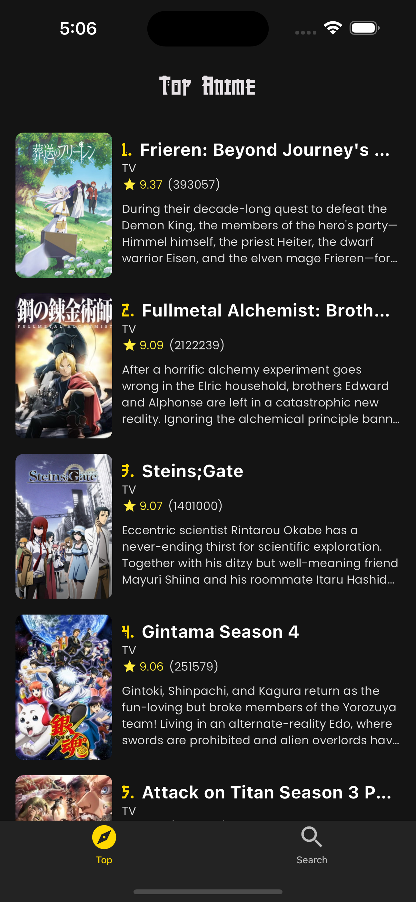
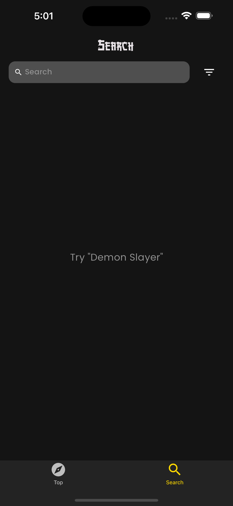
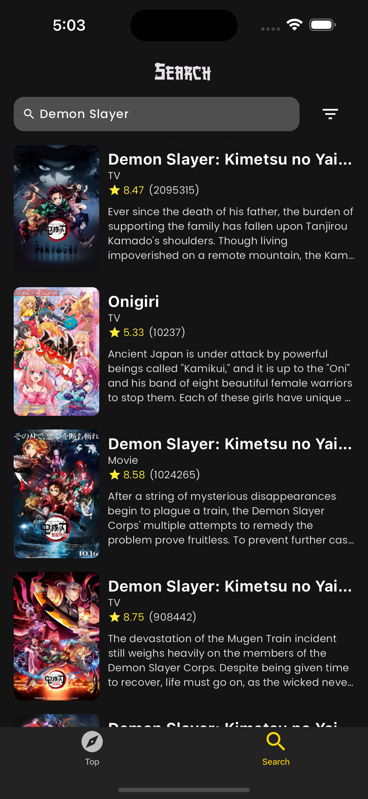
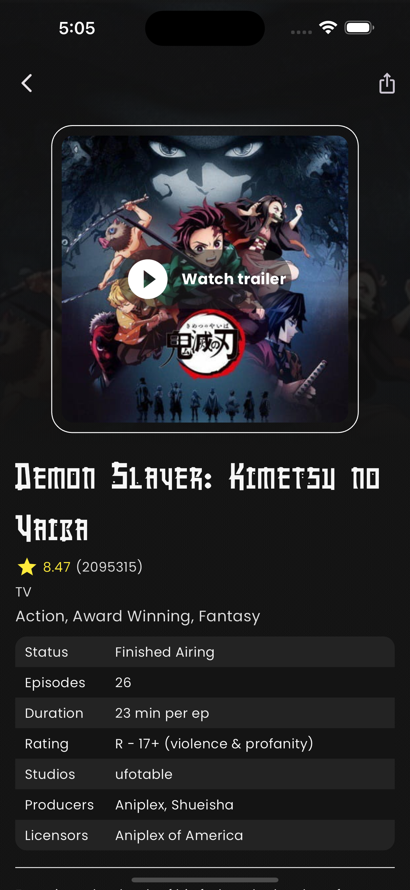
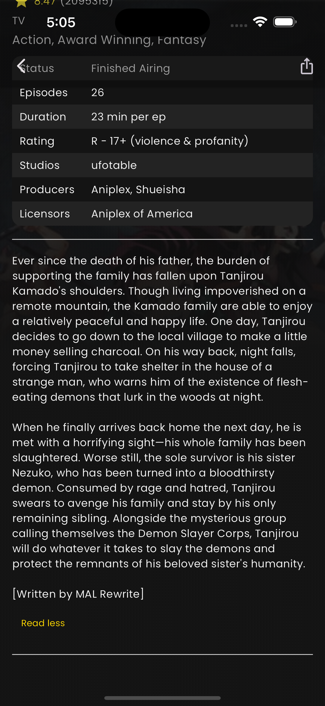

# Anime Explore
Anime Explore is a versatile application designed for effortlessly searching, exploring, and enjoying your favorite anime titles. 

## Features
- <strong>Seamless Search Functionality</strong>: Effortlessly find your desired anime titles with a user-friendly search feature.
- <strong>Advanced Filtering Options</strong>: Tailor your browsing experience with advanced filtering capabilities, ensuring you discover anime that perfectly matches your preferences.
- <strong>Instant Trailer Access</strong>: Dive deeper into the world of anime by watching trailers directly within the app, providing a glimpse into the captivating stories and animation styles.
- <strong>Convenient Sharing</strong>: Share your excitement for anime discoveries with friends and fellow enthusiasts at the tap of a button, fostering lively discussions and recommendations. 

Explore, discover, and immerse yourself in the vibrant world of anime with Anime Explore.

## Gallery

  
  
  
  
  

<!--https://github.com/Dusk-afk/anime-explore/assets/83510709/1baa3a64-1e41-479a-ac7e-f3d436d2ac5d-->
https://github.com/Dusk-afk/anime-explore/assets/83510709/c1555d68-bcdf-4403-a270-d1088caebdd8

## Getting Started
1. Clone the repo in your local environment
2. Run `flutter pub get`
3. Finally, run `flutter run`

## Directory Architecture
- <strong>lib/bloc/</strong>: This directory is responsible for BLoC (Business Logic Component) architecture implementation. BLoCs help separate UI logic from business logic, promoting a cleaner and more maintainable codebase.

- <strong>lib/models/</strong>: This directory contains the data models used in the application. These models represent entities like anime, trailers, images, and search arguments. Organizing models in a separate directory helps keep the data layer organized and manageable.

- <strong>lib/presentation/</strong>: This directory containts all the UI-related files.

- <strong>lib/services/</strong>: Here lies the service layer of the application. Separating services from presentation logic makes it easier to test and maintain.

- <strong>lib/utils/constants/</strong>: This directory holds constant values used throughout the application such as colors, sizes, and string constants.

- <strong>lib/utils/theme</strong>: This directory contains all the theme related stuff. All the data in it is constant.

 

*Generated by **AI** while ensuring the accuracy of all provided information.*
